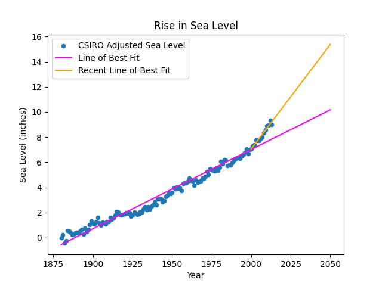

# Sea Level Predictor

This project is a solution to the [Sea Level Predictor challenge](https://www.freecodecamp.org/learn/data-analysis-with-python/data-analysis-with-python-projects/sea-level-predictor) from freeCodeCamp.

## Description

Using a dataset measuring the CSIRO Adjusted Sea Level since 1880, we predict the sea level at 2050 if it continues at the current rate. The visualizations provide insights into the trends in sea level rise, helping to understand the long-term impact of climate change.

## Example Findings

One chart has been generated and saved in the root directory:

### Sea Level Plot

  
This plot illustrates the rise in sea level over time, showing both historical data and predictions up to the year 2050. The scatter plot represents the observed sea levels, while the lines of best fit (for the entire period and for data from the year 2000 onwards) show the trend. The graph reveals that the rate at which the sea level rises has increased dramatically after the year 2000. If the trend continues, we could see the sea level reach over 15 inches by 2050!
